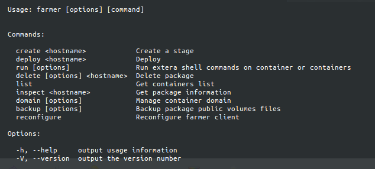

# Farmer Client
Farmer is an open source project to help you run a small SaaS platform with minimum overhead.

Using Farmer client, you can interact with farmer server. You can create and manage [seeds](docs/glossary.md#seed), set up multiple [plants](docs/glossary.md#plant), deploy new changes to your seed and release on every plant.


## Glossary
To get familiar with the few words we're using please refer to [Glossary](docs/glossary.md)

## Usage
* First you should create a `.farmer.yml` in your project root, along with a `compose.yml` and a few scripts that farmer will use. The structure can be like below:
	* .farmer.yml
    ```yml
    containers:
        db:
          image: mysql:5.7
          env:
            - MYSQL_ROOT_PASSWORD=sample

        web:
          image: bare
          ports:
            - 22/tcp
            - 80/tcp
            - 9082/udp
          links:
            - db
            - mail

        mail:
          image: mailserver:latest

    dirs:
        web:
            - /app

    shell:
        create:
          web: devops/farmer/create.yml
        deploy:
          web: devops/farmer/deploy.yml
    ```
	* devops/farmer/create.yml
    ```yml
        ---
        # 1) Preparation
        - apt-get update -y -q
        - apt-get install git nodejs -y -q
        - npm install -g forever

        # 2) Clone the codebase & install dependencies
        - git clone http://example.com/php-project.git /app
        
        # 3) Start your application
        - forever start /app/src/index.js
    ```
	* devops/farmer/deploy.yml
    ```yml
        ---
        # 1) Pull new codebase
        - git reset --hard
        - git pull -u origin master
        
        # 2) Restart your application
        - forever restart /app/src/index.js 
    ```
### Screenshot


### Seed Commands
A seed is a completely woking instance that is being used (its built artifacts and docker image) to create plants. **Every project release should only have 1 seed.**

* **create** *< hostname >*   
Creates a seed with your given system-wide unique hostname. Fortunately farmer will handle containers links dependecies so you shall not worry about in what order you write containers definition.
    ```sh
    ~/project$ farmer create foobar
    ```
    
* **deploy** *< hostname >*   
Runs the deploy script on an existing seed.
    ```sh
    ~/project$ farmer deploy foobar-project
    ```
    
* **delete** *[options]* *< hostname >*   
Deletes a seed (along with its mounted dirs/volumes, domains, backups and of course containers).
    ```sh
    ~/project$ farmer delete foobar
    ~/project$ farmer delete --keep-volumes foobar-project
    ```
    
* **run** [command/yaml-file-path/tag] *< hostname >:< alias >*   
Runs a custom command or a yaml script on a single container of a seed.
    ```sh
    ~/project$ farmer run command "apt-get install -y nano" foobar-project:web
    ~/project$ farmer run yaml devops/farmer/custom.yml foobar-project:web
    ~/project$ farmer run tag deploy foobar-project:web
    ```

### Plant Commands
TO BE WRITTEN SOON.

### General Commands
These commands can be run on any seed or plant by provising its hostname.

* **inspect** *< hostname >*   
Shows all information of a seed or plant. It includes volmues/dirs, assigned domains, exposed ports and docker IP address, conatiners' image name, ID and state.
    ```sh
    ~/project$ farmer inspect foorbar-instance-1
    ~/project$ farmer inspect foorbar-project
    ```
    
* **domain** [add/remove] *< hostname >:< alias > < domain >*   
Assigns a new domain on a single container of a seed.
    ```sh
    ~/project$ farmer domain add foobar:web foobar-project.example.com
    ~/project$ farmer domain remove foobar:web foobar-project.example.com
    ```
    
* **domain** list *< hostname >*   
Lists all assigned domains to all containers of a seed.
    ```sh
    ~/project$ farmer domain list foobar-project
    ```

* **backup** create *< hostname > < tag >*   
Creates a new backup of mounted dirs/volumes of any seed or plant, with your provided tag name which should be a unique identity in the whole system.
    ```sh
    ~/project$ farmer backup create foorbar-instance-1 my_instance_1_unqiue_tag_name
    ```

* **backup** restore *< tag >*   
Restores a backup of any seed or plant.
    ```sh
    ~/project$ farmer backup restore my_instance_1_unqiue_tag_name
    ```
    
* **backup** delete *< tag >*   
Deletes a single backup.
    ```sh
    ~/project$ farmer backup delete my_instance_1_unqiue_tag_name
    ```
    
    
* **backup** list *< hostname >*   
Lists all backups of a seed or plant.
    ```sh
    ~/project$ farmer backup list foorbar-instance-1
    ```
    
